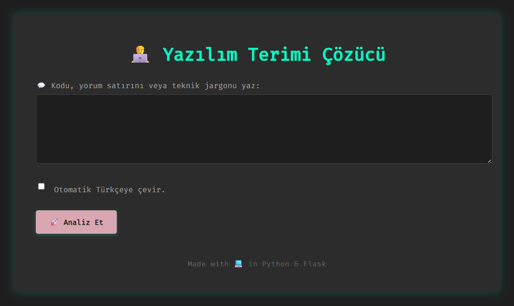
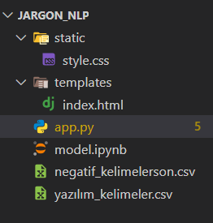
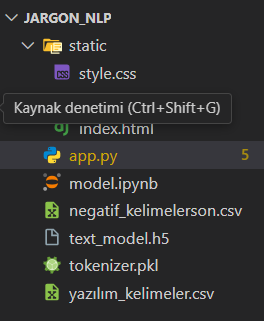

<h1 style="color:#555555;">👨‍💻 Yazılım Terim Çözücü</h1>

<h2 style="color:#666666;">📝 Proje Özeti</h2>

Yazılım terimlerini içeren metinleri otomatik tanıyan, açıklamalarını sunan ve teknik olmayan kelimeleri ayıklayan bir web uygulamasıdır. Kullanıcıya ayrıca terimlerin Türkçe çeviri seçeneği de sağlanır.

<h2 style="color:#666666;">📸 Proje Ekran Görüntüsü</h2>

<h2 style="color:#666666;">🛠️ Kullanılan Teknolojiler</h2>

- Visual Studio Code (Kaynak kod editörü)
- Python 3 (Flask)  
- TensorFlow / Keras (Makine Öğrenimi Modeli)  
- Pandas (Veri İşleme)  
- Deep Translator (Çeviri Servisi)  
- HTML & CSS (Arayüz Tasarımı)  
- Jinja2 (Şablon Motoru)

<h2 style="color:#666666;">🎯 Uygulama Özellikleri</h2>

- Yazılım terimlerini metin içinde tespit eder.  
- Terimlerin anlamlarını kullanıcıya gösterir.
- Yazılım dışı kelimeleri listeler.  
- İsteğe bağlı Türkçe çeviri yapar.  
- Terimlerin başarı oranını sayısal ve görsel sunar.  

<h2 style="color:#666666;">📁 Proje Dosya Dizini</h2>

<h2 style="color:#666666;">🚀 Kurulum ve Çalıştırma</h2>

1. Projeyi indirin veya klonlayın. (Zip formunda ise dosyayı ayıklayın.) 
2. Visual Studio'da klasörü açın.
3. model.ipynb dsyasında çekirdek seçip çalıştırın.
4. Model eğitildikten sonra dosya dizinine iki tane dosya eklenecek.(text_model.h5/tokenizer.pkl)

5. app.py dosyasını terminalde çalıştırın.
6. Terminalde çıkan adresi ctrl tuşuna basarak tarayıcıda açmasını sağlayın.

<h2 style="color:#666666;">📅 Geliştirilecek Alanlar</h2>

* Sadece yazılım ile ilgili tavsiyeler veren sohbet botuna dönüşüm.

* Daha geniş kapsamlı yazılım terimi veritabanı ekleme

* Çok dilli çeviri ve destek

* Model doğruluğunu artırmak için ek yapay zeka geliştirmeleri

* Mobil uygulama oluşturulması.

